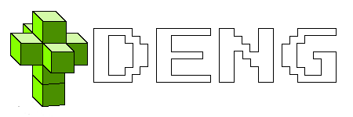

# DENG

  
DENG is a cross platform high level game development framework / engine designed to keep game development process
simple and straight forward. Currently not much has been implemented yet, but the list of already implemented 
features is following: 
* 3D model renderering  
* 2D model renderering  
* 2D shape generator  
* Editor and first person camera systems  
* Game entity data registry system  
* Asset texture mapping  
* Custom asset format  
* Wavefront OBJ parser
* Point light

Features that are not yet implemented but are coming soon are following:  
* Other lighting components (directional light and global light sources)  
* OpenGL support for legacy graphics cards  
* Lua scripting layer for game scripting  
* libjpeg and libpng integration for supporting additional texture formats  
* Custom mapdata format  
* Map editor tool  

## Getting started
DENG build files can be generated with [premake5](https://github.com/premake/premake-core). Before generating any
build file, make sure that all submodules are initialised. For that either git clone the repo with `--recursive` flag or
initialise and update submodules using `$ git submodule init` and `$ git submodule update` accordingly.

Possible premake flags for DENG are following:  
| Flag          | Possible values       | Description                                                                   |
| :---          | :--------------       | ----------:                                                                   |
| sandbox-mode  | all, deng, imgui      | Sandbox test application modes                                                |
| vk-sdk-path   | [PATH_TO_VULKAN_SDK]  | Specify the Vulkan SDK path (Required for Windows)                            |

### GNU/Linux or potentially other Unix like operating systems excluding MacOS

#### Prerequisites
* Gnu toolchain (gcc, make)  
* Vulkan headers  
* Xlib
* XCursor
* Premake5

#### Building
Generating Makefiles using premake is pretty straight forward:  
`$ premake5 [OPTIONS] gmake`  

After generating the Makefiles make sure that `config` variable is specifed as either `debug_linux` or `release_linux`.
Build command should now look something like this:  
`$ make config=debug_linux [-jN]` for debug build or  
`$ make config=release_linux [-jN]` for release build

### Microsoft Windows

NOTE: In Windows the DENG runtime library is built as a static library for now.  

#### Prerequisites
* Visual Studio  
* Vulkan SDK  
* Premake5  

#### Building
Premake command to generate solution files should now look something like this:  
`premake5 --use-modules --vk-sdk-path=<PATH_TO_VULKAN_SDK>`  

After that is done open newly generated `deng.sln` file and build the project normally using Visual Studio.
